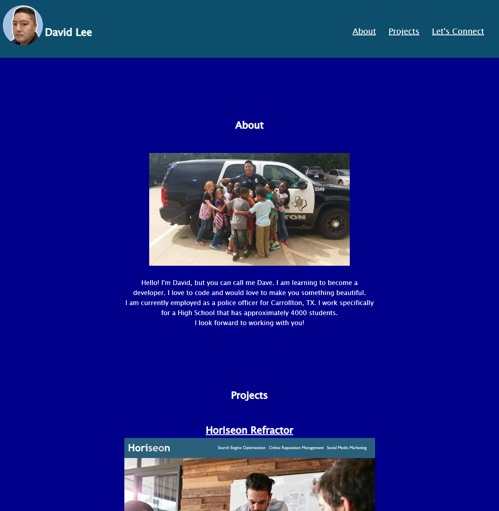

# PortfolioHW
The portfolio project is my working portfolio. As i build more projects and have more experience, I will continue to add and grow my portfolio.

By David Lee.

## Technologies Used
HTML
CSS

## User Story
```
AS AN employer
I WANT to view a potential employee's deployed portfolio of work samples
SO THAT I can review samples of their work and assess whether they're a good candidate for an open position
```

## Acceptance Criteria
```
GIVEN I need to sample a potential employee's previous work
WHEN I load their portfolio
THEN I am presented with the developer's name, a recent photo or avatar, and links to sections about them, their work, and how to contact them 
WHEN I click one of the links in the navigation
THEN the UI scrolls to the corresponding section
WHEN I click on the link to the section about their work
THEN the UI scrolls to a section with titled images of the developer's applications
WHEN I am presented with the developer's first application
THEN that application's image should be larger in size than the others
WHEN I click on the images of the applications
THEN I am taken to that deployed application
WHEN I resize the page or view the site on various screens and devices
THEN I am presented with a responsive layout that adapts to my viewport
```

## About
Welcome to my portfolio. It’s in its infant stages as I don’t have many projects to add, however, that will very soon change. I’m excited to bring you many and new projects to hopefully show you my caliber with coding and to work together. Be on the look out for new content!

I cmae across some CSS styling issues as it was definately a trial and error understanding what certain coding will do and having it done the way i wanted. Although, creatively, this isnt waht i want my final page to be, i look forward to creating a very interactive and intuitive portfolio.

## Usage
Utilizing the site is simple! 

Load the site by copying and pasting the link on to a browser.
* https://kpxcrew.github.io/PortfolioHW/

Once open, click on any of the three topics in the navigation bar. The title will redirect you to the location on the page that porvides more information in respect to the subject. 

## Screenshots


## Sources
https://loremipsum.io/
* I used this site for palceholder text.

https://meyerweb.com/eric/tools/css/reset/
* I used this reset style cheet as its very comprehensive.

https://www.w3schools.com/
* I used this resource as its able to teach you many things about many topics.

https://unsplash.com/photos/bYiw48KLbmw
* I used this for free licensed stock images.

https://picofme.io/featured
* I used this to create a new avatar.

https://coolors.co/
* This was a great resource to find color pallets.

https://techstacker.com/how-to-loop-background-color-animation-css/
* I used this resource to figure out how to animate my nav bar.


